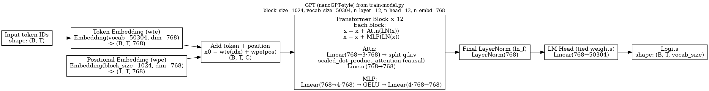

# GPT

This is my own implementation of GPT 2


This covers both Tokenization and Pretraining from scratch.

I wanted to try to make this a little bit end to end by implementing SFT with LoRA using transformers, quantization using llama.cpp and inference with llama.cpp and huggingface. I'll try implementing these from scratch in future projects.

I skiped out on RLHF. That's probably be for a better project :)

I used an A100 and an 8xA100 GPU cluster, attatched to a filesystem. This setup roughly cost me 80 dollars. 

Setup, tokenization, pretraining, sft roughly takes 4 hours.

You can run this in llama.cpp or if you want to try running this on your ios/android device, I reccomend pocketpal. 

- **Hugging Face repo:** [svshrithik12/GPT2](https://huggingface.co/svshrithik12/GPT2)

### GGUF downloads (direct)
- **Q4_K_M (recommended):** [gpt2-Q4_K_M_2.gguf](https://huggingface.co/svshrithik12/GPT2/resolve/main/src/gpt2-Q4_K_M_2.gguf)
- **f16:** [gpt-f16-2.gguf](https://huggingface.co/svshrithik12/GPT2/resolve/main/src/gpt-f16-2.gguf)

### GGUF files (browse in repo)
- [src/gpt2-Q4_K_M_2.gguf](src/gpt2-Q4_K_M_2.gguf)
- [src/gpt-f16-2.gguf](https://github.com/a-ghorbani/pocketpal-ai)

## [PocketPal (iOS/Android)] (src/gpt-f16-2.gguf)
1. Open PocketPal → **Models** → **Add / Download** → **Hugging Face**
2. Search: `svshrithik12/GPT2`
3. Pick one:
   - `gpt2-Q4_K_M_2.gguf` (smaller, faster)
   - `gpt-f16-2.gguf` (larger, higher quality)

---
## Transformer Architecture 




## `train-model.py`

This file contains **both** the model implementation **and** the training loop.

### 1) Model code 

# Key classes and components

This doc maps the main code in this repo to the conceptual pieces of the model and training pipeline.

## train-model.py

### `GPTConfig`
Holds model hyperparameters:

- `block_size` (context length, max T)
- `vocab_size` (V)
- `n_layer` (L)
- `n_head` (H)
- `n_embd` (C)

### `GPT`
Top-level decoder-only Transformer.

Key submodules:

- `wte`: token embedding matrix $W_E \in \mathbb{R}^{V\times C}$
- `wpe`: position embedding matrix $W_P \in \mathbb{R}^{T_{\max}\times C}$
- `h`: stack of `Block` modules (length `n_layer`)
- `ln_f`: final LayerNorm
- `lm_head`: output projection to vocab (**tied** to `wte`)

### `Block`
One Transformer block (pre-LN residual):

- `ln_1` → `attn` → residual add
- `ln_2` → `mlp` → residual add

### `CausalSelfAttention`
Multi-head causal self-attention:

- projects $X$ into $Q,K,V$
- uses causal masking ($s>t$ masked) via fused attention
- projects concatenated heads back to $C$

### `MLP`
Feed-forward network:

- $C\to 4C\to C$ with GELU

### `DataLoaderLite`
Loads tokenized `.npy` shards and yields `(x, y)` pairs for next-token prediction.

---

## fineweb.py

- downloads FineWeb-Edu split
- tokenizes with GPT-2 BPE (tiktoken)
- writes token shards to disk as `.npy` (first shard often used as validation)

---

## evals.py

Standalone HellaSwag evaluator (multiple-choice by loss).
To use it with your trained model, swap HF model loading for your `GPT` checkpoint.

---

## Transformer formulas 


**Notation:** batch $B$, sequence length $T$, embedding dim $C$, heads $H$, head dim $d=C/H$, vocab $V$, layers $L$.

### Token + positional embeddings

Let token embedding matrix $W_E \in \mathbb{R}^{V\times C}$ and position embedding matrix $W_P \in \mathbb{R}^{T_{\max}\times C}$.
With token IDs $\mathrm{idx}\in\{0,\dots,V-1\}^{B\times T}$ and positions $p_t=t$:

$$
\begin{aligned}
x_0[b,t,:] = W_E[\mathrm{idx}_{b,t}] + W_P[p_t]
\quad \in \mathbb{R}^{C}.
\end{aligned}
$$

### LayerNorm (per token, over channels)

For $u\in\mathbb{R}^{C}$:

$$
\begin{aligned}
\mu(u) &= \frac{1}{C}\sum_{i=1}^{C} u_i, \\
\sigma^2(u) &= \frac{1}{C}\sum_{i=1}^{C}\left(u_i-\mu(u)\right)^2, \\
\mathrm{LN}(u) &= \gamma \odot \frac{u-\mu(u)}{\sqrt{\sigma^2(u)+\varepsilon}} + \beta,
\end{aligned}
$$

with learnable $\gamma,\beta\in\mathbb{R}^{C}$.

### Transformer block (Pre-LN residual), repeated for $l=0,\dots,L-1$

$$
\begin{aligned}
x_{l+\frac12} &= x_l + \mathrm{Attn}\!\left(\mathrm{LN}(x_l)\right),\\
x_{l+1} &= x_{l+\frac12} + \mathrm{MLP}\!\left(\mathrm{LN}(x_{l+\frac12})\right).
\end{aligned}
$$

### Multi-head causal self-attention

Given $X=\mathrm{LN}(x)\in\mathbb{R}^{B\times T\times C}$, per head $h\in\{1,\dots,H\}$:

$$
\begin{aligned}
Q^{(h)} &= X W_Q^{(h)} + b_Q^{(h)},\\
K^{(h)} &= X W_K^{(h)} + b_K^{(h)},\\
V^{(h)} &= X W_V^{(h)} + b_V^{(h)},
\end{aligned}
$$

where $Q^{(h)},K^{(h)},V^{(h)}\in\mathbb{R}^{B\times T\times d}$.

Causal masked scores:

$$
\begin{aligned}
S^{(h)}_{t,s} &= \frac{\langle Q^{(h)}_{t},K^{(h)}_{s}\rangle}{\sqrt{d}} + M_{t,s},\\
M_{t,s} &=
\begin{cases}
0, & s \le t,\\
-\infty, & s > t.
\end{cases}
\end{aligned}
$$

Attention weights and output:

$$
\begin{aligned}
A^{(h)}_{t,s} &= \mathrm{softmax}_s\!\left(S^{(h)}_{t,s}\right),\\
O^{(h)}_{t} &= \sum_{s=0}^{T-1} A^{(h)}_{t,s}\, V^{(h)}_{s}.
\end{aligned}
$$

Concatenate heads and project:

$$
\begin{aligned}
O &= \mathrm{Concat}\left(O^{(1)},\dots,O^{(H)}\right)\in\mathbb{R}^{B\times T\times C},\\
\mathrm{Attn}(X) &= O W_O + b_O \in \mathbb{R}^{B\times T\times C}.
\end{aligned}
$$

### MLP (feed-forward)

Uses expansion ratio $4\times$:

$$
\begin{aligned}
\mathrm{MLP}(X) &= \mathrm{GELU}(XW_1+b_1)\,W_2 + b_2,\\
W_1 &\in \mathbb{R}^{C\times 4C},\quad W_2\in \mathbb{R}^{4C\times C}.
\end{aligned}
$$

### GELU (tanh approximation)

$$
\mathrm{GELU}(z)=\frac12 z\left(1+\tanh\left(\sqrt{\frac{2}{\pi}}\left(z+0.044715 z^3\right)\right)\right).
$$

### Final LayerNorm + LM head (tied weights)

Let $\hat{x}=\mathrm{LN}_f(x_L)$:

$$
\begin{aligned}
\mathrm{logits} &= \hat{x} W_U + b_U \in \mathbb{R}^{B\times T\times V},\\
W_U &= W_E^\top \quad \text{(weight tying)}.
\end{aligned}
$$

### Training objective (next-token cross entropy)

With targets $y\in\{0,\dots,V-1\}^{B\times T}$:

$$
\begin{aligned}
p(y_{b,t}\mid x) &= \mathrm{softmax}(\mathrm{logits}_{b,t,:})_{y_{b,t}},\\
\mathcal{L} &= -\frac{1}{BT}\sum_{b=1}^{B}\sum_{t=1}^{T}\log p(y_{b,t}\mid x).
\end{aligned}
$$

---

## Walkthrough: `fineweb.py`

This script builds  **tokenized training shards** from FineWeb-Edu.

What it does:

* Loads dataset:

  * `load_dataset("HuggingFaceFW/fineweb-edu", name="sample-10BT", split="train")`
* Tokenizes with `tiktoken.get_encoding("gpt2")`
* Prepends `<|endoftext|>` token to each document
* Writes `.npy` shards of **`shard_size = 1e8` tokens** each
* Uses multiprocessing (`os.cpu_count()//2` workers)
* Naming:

  * first shard is `"val"` (so you always have a validation shard)
  * later shards are `"train"`
  * output files look like: `edufineweb_train_000001.npy` (numpy adds `.npy`)

What to change most often:

* `remote_name` (`sample-10BT` → bigger subsets if you want)
* `shard_size` (smaller if disk is tight / you want more shards)
* `local_dir` (just make it match `train-model.py`’s `data_root`)


---

## Start to End Execution 

## Repo layout 

* **Training / pipeline code (all in `src/`)**

  * `fineweb.py` → tokenization to `src/edu_fineweb10B/`
  * `train-model.py` → pretraining, outputs to `src/log/`
  * `convert_ckpt_to_hf.py` → `.pt` checkpoint → HF folder
  * `evals.py` → eval HF folder on HellaSwag
  * `sft.py` → LoRA SFT (outputs `src/hf_sft_lora/`)
  * `merge_lora.py` → merge LoRA into base (outputs merged HF folder)
  * `user_assistant.jinja` → your llama.cpp chat template
* **Artifacts produced(these will not be included in the git repo but you can find them on huggingface)**

  * `src/log/model_19072.pt` (final pretrain ckpt)
  * `src/hf_pretrained/` (HF-exported base)
  * `src/hf_sft_lora/` (LoRA adapters + checkpoints)
  * `src/hf_sft_merged/` (merged HF model)
  * `src/gpt2-Q4_K_M_2.gguf` (quantized GGUF)

---

##  Two-instance architecture (what runs where)

I used **two Lambda GPU instances** mounted to the **same shared filesystem**:

* **Instance A (8×A100)**: **Pretraining**
* **Instance B (1×A100)**: **Tokenization + Eval + SFT + Merge + GGUF conversion + Quantization + Upload**

> I attach the filesystem in Lambda’s UI. After attaching, verify both machines see the same path (example below).

### Verify shared mount (both instances)

```bash
df -h
ls -lah /home/ubuntu/GPT
```

Clone the repo :

```bash
export REPO=/home/ubuntu/GPT

git clone https://github.com/ShrithikShahapure/GPT.git
cd $REPO
```

---

## 1) Environment setup (run on BOTH instances)

### System deps

```bash
sudo apt-get update
sudo apt-get install -y git git-lfs python3-venv python3-pip build-essential cmake pkg-config
git lfs install
```

### Python venv + packages

```bash
cd $REPO
python3 -m venv .venv
source .venv/bin/activate
python -m pip install -U pip

pip install numpy tqdm requests tiktoken datasets transformers accelerate safetensors peft trl huggingface_hub
pip install torch --index-url https://download.pytorch.org/whl/cu121
```

### (Optional but recommended) Put HF caches on the shared filesystem

This avoids re-downloading datasets/models separately on each instance:

```bash
export HF_HOME=$REPO/.hf
export HF_DATASETS_CACHE=$HF_HOME/datasets
export TRANSFORMERS_CACHE=$HF_HOME/transformers
mkdir -p "$HF_HOME"
```

---

## 2) Build llama.cpp (do on the machine you’ll convert/quantize/test on)


```bash
cd $REPO
git clone https://github.com/ggml-org/llama.cpp
cmake -S llama.cpp -B llama.cpp/build -DGGML_CUDA=ON
cmake --build llama.cpp/build -j
```

`llama.cpp` expects models in **GGUF** and provides conversion scripts. ([GitHub][1])

---

## 3) Tokenization (run on **Instance B: 1×A100**)

### 3.1 Run FineWeb tokenization

This writes shards under `src/edu_fineweb10B/`:

```bash
cd $REPO
source .venv/bin/activate
python src/fineweb.py
```

### 3.3 Ensure `hellaswag.py` exists (only if missing)

`train-model.py` imports `hellaswag`. If `src/hellaswag.py` doesn’t exist, do:

```bash
cd $REPO/src
cp -f evals.py hellaswag.py
```

---

## 4) Pretraining (run on **Instance A: 8×A100**)

From your repo root:

```bash
cd $REPO
source .venv/bin/activate
cd src
torchrun --standalone --nproc_per_node=8 train-model.py
```

### Watch training logs

```bash
tail -n 200 -F $REPO/src/log/log.txt
```

### Checkpoints

Your checkpoints land in:

```bash
ls -lah $REPO/src/log/model_*.pt
```

Example you currently have:

* `model_05000.pt`
* `model_10000.pt`
* `model_15000.pt`
* `model_19072.pt`

---

## 5) Convert checkpoint → Hugging Face model (run on **Instance B**)

Convert your final checkpoint into HF format (you already have `hf_pretrained`, but here’s the exact command):

```bash
cd $REPO
source .venv/bin/activate
python3 src/convert_ckpt_to_hf.py \
  --ckpt src/log/model_19072.pt \
  --out  src/hf_pretrained
```

---

## 6) Evaluate HF model (run on **Instance B**)

```bash
cd $REPO
source .venv/bin/activate
python3 src/evals.py -m src/hf_pretrained-2 -d cuda
```

---

## 7) SFT (LoRA) (run on **Instance A**)

Your repo has `src/sft.py`. Run it:

```bash
cd $REPO
source .venv/bin/activate
CUDA_VISIBLE_DEVICES=0 python3 src/sft.py
```

Expected output:

* `src/hf_sft_lora/` (adapters + checkpoints)


---

## 8) Merge LoRA → merged HF model (run on **Instance B**)

Run:

```bash
cd $REPO
source .venv/bin/activate
python3 src/merge_lora.py
```


Evaluate merged model:

```bash
cd $REPO
source .venv/bin/activate
python3 src/evals.py -m src/hf_sft_merged -d cuda
```

---

## 9) Convert merged HF → GGUF + Quantize (run on **Instance B**)

### 9.1 HF → fp16 GGUF

```bash
cd $REPO
source .venv/bin/activate

python llama.cpp/convert_hf_to_gguf.py \
  src/hf_sft_merged \
  --outfile src/gpt2-f16.gguf
```

### 9.2 Quantize to Q4_K_M

```bash
cd $REPO
./llama.cpp/build/bin/llama-quantize \
  src/gpt2-f16.gguf \
  src/gpt2-Q4_K_M_2.gguf \
  Q4_K_M
```


---


### Login

```bash
pip install -U "huggingface_hub[cli]"
hf auth login
```

### Upload the GGUF

Set your repo:

```bash
export HF_REPO="your-username/your-gguf-repo"
```

Upload:

```bash
hf upload "$HF_REPO" src/gpt2-Q4_K_M_2.gguf gpt2-Q4_K_M_2.gguf --repo-type model
```

(Optionally upload your template too)

```bash
hf upload "$HF_REPO" src/user_assistant.jinja user_assistant.jinja --repo-type model
```

---

## 11) Inference with llama.cpp (your exact “ONE paragraph + <END>” flow)

From repo root (note: your GGUF is `src/gpt2-Q4_K_M_2.gguf`):

```bash
cd $REPO

./llama.cpp/build/bin/llama-cli \
  -m src/gpt2-Q4_K_M_2.gguf \
  --jinja --chat-template-file src/user_assistant.jinja \
  -cnv -st \
  -sys "Answer in exactly ONE paragraph (no blank lines). End your answer with: <END>" \
  -r "<END>" \
  -n 200 --temp 0.2 --top-p 0.95 \
  --repeat-penalty 1.15 --repeat-last-n 128
```

---

## 12) Pull the GGUF from Hugging Face (Mac/Linux) and use it

### Download via HF CLI

```bash
pip install -U "huggingface_hub[cli]"
hf download "$HF_REPO" gpt2-Q4_K_M_2.gguf --local-dir .
```

### Or let llama.cpp pull from HF (caching supported)

Hugging Face documents running GGUFs with llama.cpp by pointing to the HF repo/file, and llama.cpp caches downloads (cache path controlled by `LLAMA_CACHE`). ([Hugging Face][2])

---

## 13) PocketPal (iPhone) — load GGUF from Hugging Face and run offline

PocketPal supports downloading **GGUF model weights** (including from Hugging Face) and chatting offline. ([App Store][3])
PocketPal’s project also notes **Hugging Face Hub integration** (browse/download models inside the app). ([GitHub][4])

### Recommended flow

1. Upload `gpt2-Q4_K_M_2.gguf` to Hugging Face (Section 10).
2. On iPhone:

   * Open PocketPal
   * Go to Models / Download / Hugging Face (wording varies by version)
   * Search your repo (`your-username/your-gguf-repo`)
   * Download `gpt2-Q4_K_M_2.gguf`
3. Start a chat offline.

> If PocketPal asks for a chat template, choose the one that matches your “User / Assistant” formatting, or keep prompts simple (your `user_assistant.jinja` template is what you used in llama.cpp).

---

